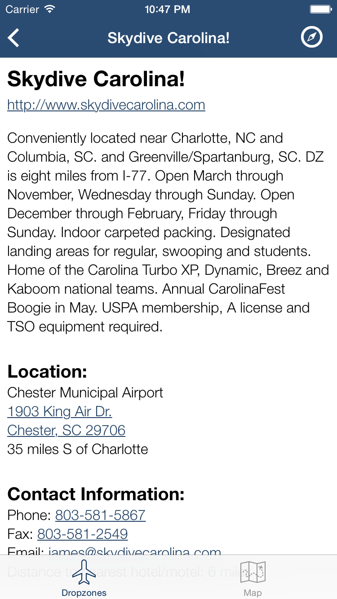

# Dropzones 

#### A [RubyMotion](http://www.rubymotion.com/) application brought to you by [Off The Grid Apps](http://otgapps.io/).

Looking for somewhere to make your first skydive? Are you an experienced skydiver looking for fun new places to jump? Then this app is for you!

Dropzones lists all current U.S. Parachute Association (USPA) member dropzones in an easy to navigate interface. Because these dropzones are USPA certified, you can be assured that the staff, training, equipment, and airplanes are top-quality!

* Quickly find the dropzones closest to where you are now!
* Search by state, region, aircraft, services offered, and training capabilities.
* See a map of every USPA dropzone in the US!
* Detailed information about each dropzone

Use this app to plan your next skydiving road trip across the United States!

This app is open source. Browse the source code here: https://github.com/OTGApps/Dropzones

## Download from the App Store

## How to run the app:

1. You must have a valid license of RubyMotion.
2. Run `bundle`
3. Run `rake pod:install`
4. Run `rake`
5. The simulator should launch automatically.

*Some features - like iMessage sending requires that you run it on an actual device. Building RubyMotion apps to a device is out of  the scope of this readme.*

## Screenshots

    

## Contributing:

1. Fork it.
2. Work on a feature branch.
3. Send me a pull request.

*I also like it when people who can't contribute [open an issue](https://github.com/OTGApps/Dropzones/issues)*
